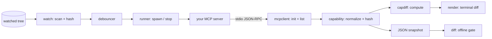

# mcpwatch

[English](README.md) | [中文](README.zh.md) | [日本語](README.ja.md)

[](LICENSE) [](go.mod) [](CHANGELOG.md)  [](CONTRIBUTING.md)

**mcpwatch：MCP サーバーのための nodemon 的オープンソースツール — ファイル変更で stdio サーバーを再起動し、リロードのたびに能力サーフェス（tools・resources・prompts）のセマンティックな diff を表示する、依存ゼロの開発ループランナー。**


```bash
git clone https://github.com/JaydenCJ/mcpwatch && cd mcpwatch
go build -o mcpwatch ./cmd/mcpwatch    # single static binary, stdlib only
```

> プレリリース：v0.1.0 はまだパッケージレジストリに公開されていません。上記の手順でソースからビルドしてください（Go ≥1.22 なら可）。

## なぜ mcpwatch？

MCP サーバーの開発で反復するのはその*サーフェス*——クライアントから見える tools・resources・prompts——なのに、フィードバックループは苦行です：保存し、サーバーを殺し、インスペクターを再起動し、tools タブを開いて、スキーマ変更が本当に反映されたか目視で確かめる。nodemon や watchexec のような汎用ウォッチャーが自動化するのは再起動だけ。MCP を話せないので、本当に知りたいこと——*何が変わったか*——は教えてくれません。公式 Inspector は MCP を話せますが手動 UI で、「前回の実行との比較」という概念がありません。mcpwatch はこのループを閉じます：ソースツリーを監視し、クリーンな停止手順でサーバーを再起動し、本物の `initialize` ハンドシェイクを実行し、すべての能力リストをページングで取得し、直前のサーフェスとの diff——`+ slugify`、`~ add_note input schema changed (2725bb… → 0d2ffb…)`——を保存した瞬間に表示します。同じ仕組みはヘッドレスでも動きます：`mcpwatch dump` がサーフェスを正規化 JSON としてスナップショットし、`mcpwatch diff` は 2 つのスナップショットが異なれば終了コード 1 を返すので、スクリプトや pre-push フックのサーフェス変更ゲートになります。

| | mcpwatch | nodemon / watchexec | MCP Inspector | 手動再起動 |
|---|---|---|---|---|
| ファイル変更で stdio サーバーを再起動 | ✅ | ✅ | ❌ | ❌ |
| MCP を話せる（ハンドシェイク・ページング・タイムアウト） | ✅ | ❌ | ✅ | ✅ 自前クライアント |
| リロード間で*何が変わったか*を表示 | ✅ セマンティック diff | ❌ | ❌ | ❌ |
| スキーマレベルの変更検出 | ✅ 正規化ハッシュ | ❌ | ❌ | ❌ |
| スクリプト可能なサーフェスゲート（終了コード） | ✅ `diff` が 1 で終了 | ❌ | ❌ | ❌ |
| ハング・クラッシュするサーバーに耐える | ✅ タイムアウト + stderr 報告 | 再起動のみ | ❌ | — |
| ランタイム依存 | 0（Go 標準ライブラリ） | npm エコシステム | npm エコシステム | — |

<sub>依存数は 2026-07-13 に確認：mcpwatch は Go 標準ライブラリのみを import。nodemon 3.x は node_modules に 27 パッケージ、@modelcontextprotocol/inspector は 80 以上を取り込みます。</sub>

## 特長

- **ライブ能力 diff** — リロードのたびに新しいサーフェスを直前の正常なものと比較し、`+` / `~` / `-` の行で表示：追加された tool、変わった説明、スキーマ変更（前後のハッシュ付き）、prompt 引数の変化、能力セクションの出現と消失。
- **コンテンツハッシュによる変更検出** — ファイルは mtime ではなく内容で比較するため、フォーマッターやビルドツールによるバイト同一の書き換えでは無駄に再起動しません。沈静化デバウンサーが連続保存をちょうど 1 回のリロードに畳み込みます。
- **バグに耐える開発ループ** — 起動しなくなったサーバーは終了コードと stderr（`[server] ` プレフィックス付き）とともに報告され、次に成功した保存は最後の*正常な*サーフェスと diff されます。ハングしたサーバーは呼び出しごとのタイムアウトで抑え込みます。
- **クリーンな再起動** — 停止は close-stdin → SIGTERM → SIGKILL の順にプロセスグループ全体へエスカレートし、`npm run dev` のようなラッパーも子プロセスごと終了、ポートやロックが確実に解放されます。
- **スクリプト向けスナップショット + ゲート** — `dump --format json` は正規化されたバイト安定なスナップショット（リストのソート、スキーマのキーソート、`schema_version: 1`）を出力し、`diff` は 2 つをオフラインで比較して差分があれば 1 で終了します。
- **プロトコルに寛容なクライアント** — カーソルページング、宣言されているのに "method not found" と答えるセクション、割り込む通知、サーバー発のリクエストまで、開発途中のサーバーの実際の振る舞いに合わせて処理します。
- **依存ゼロ・完全オフライン** — Go 標準ライブラリのみ。mcpwatch が通信するのは自分が起動したサーバープロセスだけ。テレメトリなし、ネットワーク通信は一切なし。

## クイックスタート

```bash
go build -o mcpwatch ./cmd/mcpwatch
go build -o demoserver ./examples/demoserver     # a real, spec-driven MCP server
mkdir -p demo && cp examples/notes-server.json demo/caps.json
./mcpwatch run --watch demo -- ./demoserver demo/caps.json
```

実際にキャプチャした出力——この後 `demo/caps.json` に新しい tool を追加して保存：

```text
[mcpwatch] watching demo (poll 300ms) — server: ./demoserver demo/caps.json
[mcpwatch] capability surface (2 tools, 2 resources, 1 prompt):

demo-notes 1.0.0 — protocol 2025-03-26

tools (2)
  add_note  Create a note with a title and body
  echo      Echo a message back verbatim

resources (1)
  notes://today  Today's notes  text/markdown

resource templates (1)
  notes://{date}  Notes by date  text/markdown

prompts (1)
  summarize(date, style?)  Summarize the notes of one day

[mcpwatch] 01:58:11 changed: demo/caps.json
[mcpwatch] restart #1
tools 2 → 3
  + slugify  Turn a title into a URL slug
```

ワンショットのスナップショットとオフライン diff（実出力、終了コード 1）：

```bash
./mcpwatch dump --format json -- ./demoserver demo/caps.json > baseline.json
# … edit the server …
./mcpwatch dump --format json -- ./demoserver demo/caps.json | ./mcpwatch diff baseline.json -
```

```text
server: demo-notes 1.0.0 → demo-notes 1.1.0
tools 2 → 3
  + slugify   Turn a title into a URL slug
  ~ add_note  input schema changed (2725bb191bef → 0d2ffb730518)
  ~ echo      description changed
```

自分のサーバーは `--` の後ろに置くだけ：`./mcpwatch run --watch src --include '*.py' -- python3 -m my_server`。

## CLI リファレンス

`mcpwatch <run|dump|diff|version>` — `run` と `dump` では `--` 以降がすべてサーバーコマンドで、そのまま起動されます。終了コード：0 正常（diff：一致）、1 diff が差分を検出、2 使い方エラー、3 実行時エラー。

| フラグ | 既定値 | 効果 |
|---|---|---|
| `--watch PATH`（run） | `.` | 監視するファイルまたはディレクトリ（複数可） |
| `--include GLOB`（run） | — | マッチしたファイルにのみ反応（複数可；`*`・`?`・`**`） |
| `--exclude GLOB`（run） | — | マッチしたファイルを既定リストに加えて無視（複数可） |
| `--no-default-excludes`（run） | off | 組み込み無視リスト（`.git`・`node_modules`・`*.log` など）を無効化 |
| `--poll DUR`（run） | `300ms` | 監視ツリーをスキャンする間隔 |
| `--debounce DUR`（run） | `300ms` | 最後の変更から再起動までの静穏期間 |
| `--dump-file PATH`（run） | — | （再）起動のたびに最新スナップショット JSON も書き出す |
| `--format text\|json`（dump・diff） | `text` | 出力フォーマット |
| `--timeout DUR` | `10s` | ハンドシェイクとリスト呼び出しのリクエスト単位の上限 |
| `--kill-timeout DUR` | `3s` | 停止の各段階の猶予（stdin → SIGTERM → SIGKILL） |
| `--proto VERSION` | 最新 | 要求する MCP プロトコルバージョン |
| `--quiet-server` | off | サーバーの stderr を転送せず破棄 |

## 再起動のセマンティクス

各サイクルはサーバーをゼロから起動します：spawn、`initialize`、全リスト取得、クリーンに停止。つまり保存のたびに完全な起動パス——まさにあなたが反復している部分——が検証され、起動即クラッシュは次の手動再起動を待たずその場で捕捉されます。mcpwatch は巡回検査ループであってプロキシではありません：クライアントがそれを*経由して*接続することはできません（プロキシモードはロードマップにあります）。スナップショットと diff の仕様は [docs/diff-format.md](docs/diff-format.md) に、[examples/](examples/README.md) には同梱デモサーバーでの一連のセッションがあります。

## 検証

このリポジトリに CI はありません。上記の主張はすべてローカル実行で検証されています：

```bash
go test ./...            # 91 deterministic tests, offline, no sleeps, < 5 s
bash scripts/smoke.sh    # end-to-end: build, dump, diff, live watch session — prints SMOKE OK
```

## アーキテクチャ



## ロードマップ

- [x] v0.1.0 — 監視/再起動/diff の開発ループ、ワンショット dump、オフライン diff ゲート、スキーマハッシュ付き正規化スナップショット、寛容なプロトコルクライアント、デモサーバー、91 テスト + smoke スクリプト
- [ ] プロキシモード：dump して止めるサイクルの代わりに、実クライアントの接続を再起動をまたいで維持
- [ ] `listChanged` 通知への反応：サーバーが変更を告げたら再起動なしで再 dump
- [ ] ネイティブのファイルシステムイベント（inotify / FSEvents / kqueue）を同じデバウンサーの背後に
- [ ] stdio に加えて Streamable HTTP トランスポートに対応
- [ ] リロード後の任意プローブ：選んだ tool を呼び出し、その結果まで diff

全リストは [open issues](https://github.com/JaydenCJ/mcpwatch/issues) を参照してください。

## コントリビュート

Issue・ディスカッション・PR を歓迎します — ローカルの作業フロー（gofmt、vet、テスト、`SMOKE OK`）は [CONTRIBUTING.md](CONTRIBUTING.md) を参照。入門タスクには [good first issue](https://github.com/JaydenCJ/mcpwatch/issues?q=is%3Aissue+is%3Aopen+label%3A%22good+first+issue%22) のラベルが付いており、設計の議論は [Discussions](https://github.com/JaydenCJ/mcpwatch/discussions) でどうぞ。

## ライセンス

[MIT](LICENSE)
