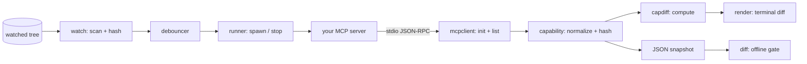

# mcpwatch

[English](README.md) | [中文](README.zh.md) | [日本語](README.ja.md)

[](LICENSE) [](go.mod) [](CHANGELOG.md)  [](CONTRIBUTING.md)

**mcpwatch：an open-source nodemon for MCP servers — a zero-dependency dev-loop runner that restarts your stdio server on file changes and prints a semantic diff of its capability surface (tools, resources, prompts) after every reload.**


```bash
git clone https://github.com/JaydenCJ/mcpwatch && cd mcpwatch
go build -o mcpwatch ./cmd/mcpwatch    # single static binary, stdlib only
```

> Pre-release: v0.1.0 is not on a package registry yet; build from source as above (any Go ≥1.22).

## Why mcpwatch?

Writing an MCP server means iterating on its *surface* — the tools, resources, and prompts a client will see — but the feedback loop is miserable: save, kill the server, restart the inspector, click through to the tools tab, and eyeball whether your schema change actually landed. Generic watchers like nodemon or watchexec automate only the restart; they don't speak MCP, so they can't tell you the thing you actually care about — *what changed*. The official Inspector speaks MCP but is a manual UI with no notion of "compared to last run". mcpwatch closes the loop: it watches your source tree, restarts the server through a clean shutdown ladder, performs the real `initialize` handshake, pages through every capability list, and prints a diff against the previous surface — `+ slugify`, `~ add_note input schema changed (2725bb… → 0d2ffb…)` — the moment you hit save. The same machinery works headless: `mcpwatch dump` snapshots a surface as canonical JSON and `mcpwatch diff` exits 1 when two snapshots differ, giving you a surface-change gate for scripts and pre-push hooks.

| | mcpwatch | nodemon / watchexec | MCP Inspector | manual restart |
|---|---|---|---|---|
| Restarts a stdio server on file changes | ✅ | ✅ | ❌ | ❌ |
| Speaks MCP (handshake, pagination, timeouts) | ✅ | ❌ | ✅ | ✅ your client |
| Shows *what changed* between reloads | ✅ semantic diff | ❌ | ❌ | ❌ |
| Schema-level change detection | ✅ canonical hashes | ❌ | ❌ | ❌ |
| Scriptable surface gate (exit codes) | ✅ `diff` exits 1 | ❌ | ❌ | ❌ |
| Survives a server that hangs or crashes | ✅ timeout + stderr report | restart only | ❌ | — |
| Runtime dependencies | 0 (Go stdlib) | npm ecosystem | npm ecosystem | — |

<sub>Dependency counts checked 2026-07-13: mcpwatch imports the Go standard library only; nodemon 3.x pulls 27 packages into node_modules, @modelcontextprotocol/inspector pulls 80+.</sub>

## Features

- **Live capability diffing** — after every reload, the new surface is compared to the last good one and printed as `+` / `~` / `-` lines: added tools, changed descriptions, schema changes (with before/after hashes), prompt argument changes, support transitions.
- **Content-hash change detection** — files are compared by content, not mtime, so byte-identical rewrites from formatters and build tools don't trigger pointless restarts; a settle debouncer folds a burst of saves into exactly one reload.
- **A dev loop that survives your bugs** — a server that no longer boots is reported with its exit code and stderr (prefixed `[server] `), and the next successful save diffs against the last *good* surface; hung servers are bounded by per-call timeouts.
- **Clean restarts** — shutdown escalates close-stdin → SIGTERM → SIGKILL across the whole process group, so `npm run dev`-style wrappers die with their children and ports/locks are actually released.
- **Snapshot + gate for scripts** — `dump --format json` emits canonical, byte-stable snapshots (sorted lists, key-sorted schemas, `schema_version: 1`); `diff` compares two offline and exits 1 on change.
- **Protocol-tolerant client** — cursor pagination, sections that are declared but answer "method not found", interleaved notifications, and server-initiated requests are all handled the way servers-in-progress actually behave.
- **Zero dependencies, fully offline** — Go standard library only; mcpwatch talks to nothing but the server process it spawned. No telemetry, no network, ever.

## Quickstart

```bash
go build -o mcpwatch ./cmd/mcpwatch
go build -o demoserver ./examples/demoserver     # a real, spec-driven MCP server
mkdir -p demo && cp examples/notes-server.json demo/caps.json
./mcpwatch run --watch demo -- ./demoserver demo/caps.json
```

Real captured output — then `demo/caps.json` gets a new tool and is saved:

```text
[mcpwatch] watching demo (poll 300ms) — server: ./demoserver demo/caps.json
[mcpwatch] capability surface (2 tools, 2 resources, 1 prompt):

demo-notes 1.0.0 — protocol 2025-03-26

tools (2)
  add_note  Create a note with a title and body
  echo      Echo a message back verbatim

resources (1)
  notes://today  Today's notes  text/markdown

resource templates (1)
  notes://{date}  Notes by date  text/markdown

prompts (1)
  summarize(date, style?)  Summarize the notes of one day

[mcpwatch] 01:58:11 changed: demo/caps.json
[mcpwatch] restart #1
tools 2 → 3
  + slugify  Turn a title into a URL slug
```

One-shot snapshots and offline diffs (real output, exit code 1):

```bash
./mcpwatch dump --format json -- ./demoserver demo/caps.json > baseline.json
# … edit the server …
./mcpwatch dump --format json -- ./demoserver demo/caps.json | ./mcpwatch diff baseline.json -
```

```text
server: demo-notes 1.0.0 → demo-notes 1.1.0
tools 2 → 3
  + slugify   Turn a title into a URL slug
  ~ add_note  input schema changed (2725bb191bef → 0d2ffb730518)
  ~ echo      description changed
```

Your own server drops in after the `--`: `./mcpwatch run --watch src --include '*.py' -- python3 -m my_server`.

## CLI reference

`mcpwatch <run|dump|diff|version>` — for `run` and `dump`, everything after `--` is the server command, spawned as-is. Exit codes: 0 ok (diff: identical), 1 diff found differences, 2 usage error, 3 runtime error.

| Flag | Default | Effect |
|---|---|---|
| `--watch PATH` (run) | `.` | file or directory to watch (repeatable) |
| `--include GLOB` (run) | — | only react to matching files (repeatable; `*`, `?`, `**`) |
| `--exclude GLOB` (run) | — | ignore matching files, added to the defaults (repeatable) |
| `--no-default-excludes` (run) | off | drop the built-in ignore list (`.git`, `node_modules`, `*.log`, …) |
| `--poll DUR` (run) | `300ms` | how often to scan the watched tree |
| `--debounce DUR` (run) | `300ms` | quiet period after the last change before restarting |
| `--dump-file PATH` (run) | — | also write the latest snapshot JSON after every (re)start |
| `--format text\|json` (dump, diff) | `text` | output format |
| `--timeout DUR` | `10s` | per-request bound for handshake and list calls |
| `--kill-timeout DUR` | `3s` | grace per shutdown step (stdin → SIGTERM → SIGKILL) |
| `--proto VERSION` | newest | MCP protocol version to request |
| `--quiet-server` | off | discard server stderr instead of forwarding it |

## Restart semantics

Each cycle boots your server from scratch: spawn, `initialize`, list everything, shut down cleanly. That means every save exercises the full boot path — the thing you are actually iterating on — and a crash-on-boot is caught immediately, not on your next manual restart. mcpwatch is an inspection loop, not a proxy: clients cannot connect *through* it (proxy mode is on the roadmap). Snapshot and diff formats are specified in [docs/diff-format.md](docs/diff-format.md), and [examples/](examples/README.md) walks through a complete session against the bundled demo server.

## Verification

This repository ships no CI; every claim above is verified by local runs:

```bash
go test ./...            # 91 deterministic tests, offline, no sleeps, < 5 s
bash scripts/smoke.sh    # end-to-end: build, dump, diff, live watch session — prints SMOKE OK
```

## Architecture



## Roadmap

- [x] v0.1.0 — watch/restart/diff dev loop, one-shot dumps, offline diff gate, canonical snapshots with schema hashes, protocol-tolerant client, demo server, 91 tests + smoke script
- [ ] Proxy mode: keep a real client attached across restarts instead of dump-and-stop cycles
- [ ] React to `listChanged` notifications: re-dump without a restart when the server announces changes
- [ ] Native filesystem events (inotify / FSEvents / kqueue) behind the same debouncer
- [ ] Streamable HTTP transport alongside stdio
- [ ] Optional post-reload probes: invoke selected tools and diff their results

See the [open issues](https://github.com/JaydenCJ/mcpwatch/issues) for the full list.

## Contributing

Issues, discussions and pull requests are welcome — see [CONTRIBUTING.md](CONTRIBUTING.md) for the local workflow (gofmt, vet, tests, `SMOKE OK`). Good entry points are labelled [good first issue](https://github.com/JaydenCJ/mcpwatch/issues?q=is%3Aissue+is%3Aopen+label%3A%22good+first+issue%22), and design questions live in [Discussions](https://github.com/JaydenCJ/mcpwatch/discussions).

## License

[MIT](LICENSE)
