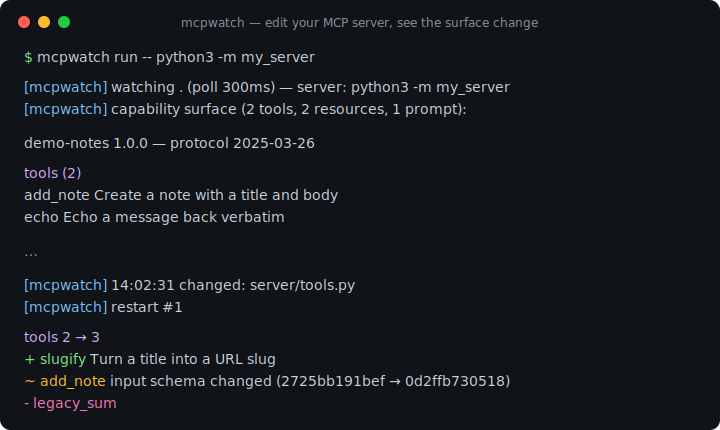
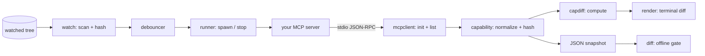

# mcpwatch

[English](README.md) | [中文](README.zh.md) | [日本語](README.ja.md)

[](LICENSE) [](go.mod) [](CHANGELOG.md)  [](CONTRIBUTING.md)

**mcpwatch：开源的 MCP 服务器版 nodemon —— 零依赖的开发循环运行器，文件一变就重启你的 stdio 服务器，并在每次重载后打印能力面（tools、resources、prompts）的语义化 diff。**



```bash
git clone https://github.com/JaydenCJ/mcpwatch && cd mcpwatch
go build -o mcpwatch ./cmd/mcpwatch    # single static binary, stdlib only
```

> 预发布：v0.1.0 尚未上架任何包仓库；请按上述方式从源码构建（Go ≥1.22 皆可）。

## 为什么选 mcpwatch？

写 MCP 服务器，迭代的是它的*表面*——客户端将看到的 tools、resources 和 prompts——但反馈循环很折磨人：保存、杀掉服务器、重启 inspector、点进 tools 标签页，再用肉眼确认 schema 改动是否真的生效。nodemon、watchexec 这类通用监视器只自动化了重启这一步；它们不懂 MCP，因此说不出你真正关心的事——*到底变了什么*。官方 Inspector 懂 MCP，却是个手动 UI，没有"与上一次运行相比"的概念。mcpwatch 把这个循环闭合了：监视你的源码树，通过干净的关停阶梯重启服务器，执行真实的 `initialize` 握手，翻页拉取每一张能力列表，然后打印与上一个表面的 diff——`+ slugify`、`~ add_note input schema changed (2725bb… → 0d2ffb…)`——就在你按下保存的那一刻。同一套机制也能无头运行：`mcpwatch dump` 把表面快照为规范化 JSON，`mcpwatch diff` 在两份快照不同时以 1 退出，为脚本和 pre-push 钩子提供表面变更门禁。

| | mcpwatch | nodemon / watchexec | MCP Inspector | 手动重启 |
|---|---|---|---|---|
| 文件变化时重启 stdio 服务器 | ✅ | ✅ | ❌ | ❌ |
| 会说 MCP（握手、分页、超时） | ✅ | ❌ | ✅ | ✅ 你的客户端 |
| 展示两次重载之间*变了什么* | ✅ 语义化 diff | ❌ | ❌ | ❌ |
| schema 级变更检测 | ✅ 规范化哈希 | ❌ | ❌ | ❌ |
| 可脚本化的表面门禁（退出码） | ✅ `diff` 以 1 退出 | ❌ | ❌ | ❌ |
| 扛得住挂起或崩溃的服务器 | ✅ 超时 + stderr 报告 | 仅重启 | ❌ | — |
| 运行时依赖 | 0（Go 标准库） | npm 生态 | npm 生态 | — |

<sub>依赖数核对于 2026-07-13：mcpwatch 只导入 Go 标准库；nodemon 3.x 往 node_modules 拉 27 个包，@modelcontextprotocol/inspector 拉 80+ 个。</sub>

## 特性

- **实时能力 diff** —— 每次重载后，新表面与上一个良好表面对比，以 `+` / `~` / `-` 行打印：新增的 tool、变化的描述、schema 变更（附前后哈希）、prompt 参数变化、能力段的出现与消失。
- **基于内容哈希的变更检测** —— 文件按内容而非 mtime 比较，格式化器和构建工具的逐字节重写不会触发无谓重启；沉降去抖器把一连串保存折叠成恰好一次重载。
- **扛得住你的 bug 的开发循环** —— 启动不起来的服务器会连同退出码和 stderr（前缀 `[server] `）一起被报告，下一次成功保存仍与最后一个*良好*表面做 diff；挂起的服务器由每调用超时兜底。
- **干净的重启** —— 关停按 close-stdin → SIGTERM → SIGKILL 逐级升级，作用于整个进程组，`npm run dev` 式的包装进程会连同子进程一起退出，端口和锁真正被释放。
- **给脚本用的快照 + 门禁** —— `dump --format json` 输出规范化、字节稳定的快照（列表排序、schema 键排序、`schema_version: 1`）；`diff` 离线比较两份快照，有变更即以 1 退出。
- **容错的协议客户端** —— 游标分页、声明了却回答 "method not found" 的能力段、穿插的通知、服务器主动发起的请求，全都按开发中服务器的实际行为来处理。
- **零依赖，完全离线** —— 只用 Go 标准库；mcpwatch 只与它自己拉起的服务器进程通信。没有遥测，永不联网。

## 快速上手

```bash
go build -o mcpwatch ./cmd/mcpwatch
go build -o demoserver ./examples/demoserver     # a real, spec-driven MCP server
mkdir -p demo && cp examples/notes-server.json demo/caps.json
./mcpwatch run --watch demo -- ./demoserver demo/caps.json
```

真实捕获输出——随后 `demo/caps.json` 加了一个新 tool 并保存：

```text
[mcpwatch] watching demo (poll 300ms) — server: ./demoserver demo/caps.json
[mcpwatch] capability surface (2 tools, 2 resources, 1 prompt):

demo-notes 1.0.0 — protocol 2025-03-26

tools (2)
  add_note  Create a note with a title and body
  echo      Echo a message back verbatim

resources (1)
  notes://today  Today's notes  text/markdown

resource templates (1)
  notes://{date}  Notes by date  text/markdown

prompts (1)
  summarize(date, style?)  Summarize the notes of one day

[mcpwatch] 01:58:11 changed: demo/caps.json
[mcpwatch] restart #1
tools 2 → 3
  + slugify  Turn a title into a URL slug
```

一次性快照与离线 diff（真实输出，退出码 1）：

```bash
./mcpwatch dump --format json -- ./demoserver demo/caps.json > baseline.json
# … edit the server …
./mcpwatch dump --format json -- ./demoserver demo/caps.json | ./mcpwatch diff baseline.json -
```

```text
server: demo-notes 1.0.0 → demo-notes 1.1.0
tools 2 → 3
  + slugify   Turn a title into a URL slug
  ~ add_note  input schema changed (2725bb191bef → 0d2ffb730518)
  ~ echo      description changed
```

你自己的服务器放在 `--` 之后即可：`./mcpwatch run --watch src --include '*.py' -- python3 -m my_server`。

## CLI 参考

`mcpwatch <run|dump|diff|version>` —— 对 `run` 和 `dump`，`--` 之后的一切都是服务器命令，原样拉起。退出码：0 正常（diff：两侧一致），1 diff 发现差异，2 用法错误，3 运行时错误。

| 参数 | 默认值 | 作用 |
|---|---|---|
| `--watch PATH`（run） | `.` | 要监视的文件或目录（可重复） |
| `--include GLOB`（run） | — | 只响应匹配的文件（可重复；`*`、`?`、`**`） |
| `--exclude GLOB`（run） | — | 忽略匹配的文件，追加在默认列表之上（可重复） |
| `--no-default-excludes`（run） | 关 | 停用内置忽略列表（`.git`、`node_modules`、`*.log` 等） |
| `--poll DUR`（run） | `300ms` | 扫描被监视目录树的频率 |
| `--debounce DUR`（run） | `300ms` | 最后一次变更后重启前的静默期 |
| `--dump-file PATH`（run） | — | 每次（重）启动后额外写出最新快照 JSON |
| `--format text\|json`（dump、diff） | `text` | 输出格式 |
| `--timeout DUR` | `10s` | 握手与列表调用的单请求上限 |
| `--kill-timeout DUR` | `3s` | 每个关停阶段的宽限期（stdin → SIGTERM → SIGKILL） |
| `--proto VERSION` | 最新 | 请求的 MCP 协议版本 |
| `--quiet-server` | 关 | 丢弃服务器 stderr 而不是转发 |

## 重启语义

每个周期都从零启动你的服务器：拉起、`initialize`、拉全列表、干净关停。也就是说每次保存都会走一遍完整的启动路径——恰恰是你正在迭代的东西——启动即崩溃会被立刻发现，而不是等到你下一次手动重启。mcpwatch 是一个巡检循环，不是代理：客户端无法*穿过*它连接（代理模式在路线图上）。快照与 diff 格式的规范见 [docs/diff-format.md](docs/diff-format.md)，[examples/](examples/README.md) 用自带的演示服务器完整走了一遍会话。

## 验证

本仓库不带 CI；上面的每一条断言都由本地运行验证：

```bash
go test ./...            # 91 deterministic tests, offline, no sleeps, < 5 s
bash scripts/smoke.sh    # end-to-end: build, dump, diff, live watch session — prints SMOKE OK
```

## 架构



## 路线图

- [x] v0.1.0 —— 监视/重启/diff 开发循环、一次性 dump、离线 diff 门禁、带 schema 哈希的规范化快照、容错协议客户端、演示服务器、91 个测试 + smoke 脚本
- [ ] 代理模式：让真实客户端跨重启保持连接，替代 dump 后即停的周期
- [ ] 响应 `listChanged` 通知：服务器宣告变更时直接重新 dump，无需重启
- [ ] 原生文件系统事件（inotify / FSEvents / kqueue），复用同一个去抖器
- [ ] 在 stdio 之外支持 Streamable HTTP 传输
- [ ] 可选的重载后探针：调用选定的 tool 并对其结果做 diff

完整列表见 [open issues](https://github.com/JaydenCJ/mcpwatch/issues)。

## 参与贡献

欢迎 issue、讨论与 PR —— 本地工作流（gofmt、vet、测试、`SMOKE OK`）见 [CONTRIBUTING.md](CONTRIBUTING.md)。入门任务标注为 [good first issue](https://github.com/JaydenCJ/mcpwatch/issues?q=is%3Aissue+is%3Aopen+label%3A%22good+first+issue%22)，设计问题请到 [Discussions](https://github.com/JaydenCJ/mcpwatch/discussions)。

## 许可证

[MIT](LICENSE)
